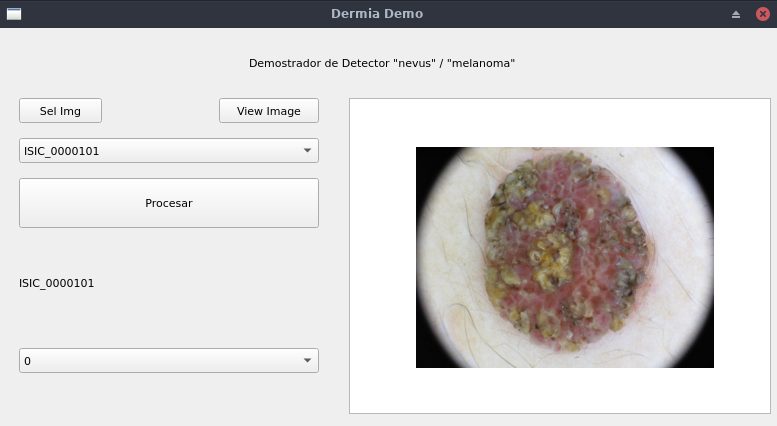
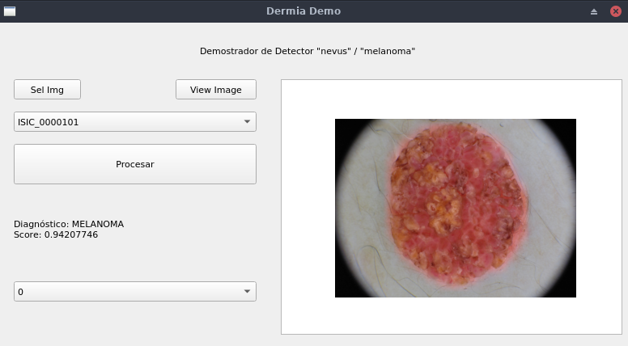

# dermia_demo

**DEMO** de software de detección y clasificación de patologías dermatológicas. 

El core es una *Deep Residual Learning Network* [RESNET-50](https://arxiv.org/abs/1512.03385) (NN), empleando [PyTorch](https://pytorch.org).
El corpus de entrenamiento se extrajo de *International Skin Imaging Collaboration* [ICIC](https://www.isic-archive.com).

## Interfaz de Usuario.

 

La Interfaz es muy simple, se carga una imagen, mediante el botón `Sel Img`, y se puede visualizar presionando `View Image`(ver figura superior).
Presionando `Procesar` la imagen entra a la NN, y se detectan y clasifican tales detecciones. Los resultados se muestran al finalizar (ver la figura inferior)

Para hacer un poco más dinámica la interfaz, se implementaron dos cajas de selección (`box`). Mediante `box` superior se pueden seleccionar las imágenes cargadas con `Sel Img`. `box` inferior permite seleccionar los resultados arrojados por la NN para la imagen seleccionada.

Se detectan sólo dos categorías, **nevus** y **melanoma**, no hay mayores especificidades en el diagnóstico. Esta limitante está dada por el corpus de ISIC. 

Para ejecutarlo, en el directorio `dermia_demo/`:

`% python3 dermia_demo.py`

## Condiciones de testeo.
Se testeó empleando:

- Python 3.8 (se recomienda no emplear Python 3.9)
- [PyTorch 1.6.0](https://pypi.org/project/torch/1.6.0/)
- [Torchvision 0.7.0](https://pypi.org/project/torchvision/0.7.0/)
- [Matplotlib](https://pypi.org/project/matplotlib/): hay otras librerias más prolijas como [PyQtGraph](https://http://www.pyqtgraph.org/), tal vez en otra versión.
- [PyQt5](https://pypi.org/project/PyQt5/) 
  - Es neciesario [OpenCV Headless](https://pypi.org/project/opencv-python-headless/)
  - Imagino que [OpenCV](https://pypi.org/project/opencv-python/) también.
- [Numpy](https://pypi.org/project/numpy/), es dependencia de PyTorch.

Se entrenó y testeó en una computadora con **CUDA 11.0**.También se testeó en una computadora con sólo **CPU**, modelo un `Intel(R) Atom(TM) x5-z8350 CPU @ 1.44GHZ` con `2GB` de RAM. 

Es importante tener en cuenta que, si se corre en OSX Catalina, el SO tiene por defecto **Python 3.9**, y Pytorch no es estable con esa versión de Python. En este caso, en particular, **no anda**.

El entrenamiento de la red **NO** fue exhaustivo, el protocolo se definió en 50 épocas, buscando que F>1.2, y una probabilidad de detección correcta por arriba de 0.8. Es buena detectando, no tanto clasificando.

## Corpus.
Se bajaron 2400 imágenes de ICIC, lamentablemente, sólo el 6% de esas imágenes (144) corresponden a **melanomas**, y por lo tanto el corpus tiene un bias importante. Para entrenar la red, se generó un corpus de 288 elementos, compuesto por los **144 melanomas** y **144 nevus** elegidos en forma aleatoria. Por cada época de entrenamiento, se elegían nuevas imágenes correspondientes a nevus. Desde ya, esta estrategia genera un overfitting de los melanomas en relación con los nevus.
Otra opción es no renovar los nevus en cada época, lo que reduce el corpus a 288 elementos. Para los fines prácticos del demostrador, es útil también.

## Parámetros.
En el repo no se encuentran los parámetros de la red, se deben descargar y mover al directorio `model/'.  
- [ISICModel_parameters.pt](https://drive.google.com/file/d/1tMS0KXOhvCH4UiPTf-nt093U0OG3gmf9/view?usp=sharing)

